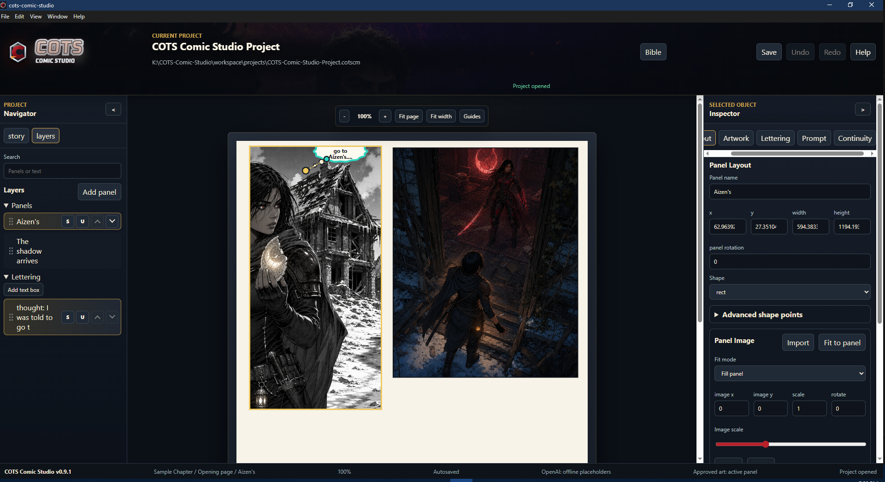

# COTS Comic Studio

**COTS Comic Studio v1.0.0 is available for Windows.**

[Download COTS Comic Studio](https://github.com/imabeast5212011-sketch/COTS-Comic-Studio-Releases/releases/latest)

COTS Comic Studio is a local-first Windows desktop app for building comic projects. It helps you organize episodes and pages, draw and resize panels, keep a project Bible, build image prompts, import or generate artwork, add lettering, and export finished pages.

Created by COTS Beasto

## Anti-Scam Notice

**COTS Comic Studio is free to download and use. If you paid someone specifically for a copy of this software, you did not purchase an official paid edition. Download it only from the official COTS Comic Studio release page.**

Official download page: [COTS Comic Studio Releases](https://github.com/imabeast5212011-sketch/COTS-Comic-Studio-Releases/releases/latest)

If someone reposts the app, charges for it as a standalone product, bundles it with suspicious installers, or claims to be the official publisher, do not install that copy.

## Downloads

The latest release includes two Windows builds:

| Build | Best for | Updates | Notes |
| --- | --- | --- | --- |
| Setup installer | Normal use | Can check the public GitHub release feed and offer updates after user approval | Lets you choose install location and optional shortcuts. Shows the EULA before installation. |
| Portable EXE | Testing, removable drives, or no-install use | Manual download only | Runs without the installer. Prompts for EULA acceptance on first launch for the current material EULA version. |

Most users should download the setup installer. Use the portable EXE when you specifically want a no-install copy.

## Windows SmartScreen

COTS Comic Studio v1.0.0 is currently an unsigned Windows build, so Windows SmartScreen may warn that the publisher is unknown.

To run the official installer:

1. Download only from the [official latest release](https://github.com/imabeast5212011-sketch/COTS-Comic-Studio-Releases/releases/latest).
2. When SmartScreen appears, choose **More info**.
3. Confirm the app name is COTS Comic Studio.
4. Choose **Run anyway** only if you trust the file and downloaded it from the official release page.

Do not bypass SmartScreen for copies from unknown mirrors, file-sharing sites, private messages, or unofficial installers.

## What You Can Do

- Create `.cotscm` comic projects stored locally on your own machine.
- Organize episodes, pages, panels, text boxes, and project layers.
- Rename, reorder, move, resize, rotate, and delete comic elements.
- Build rectangular and polygon panel layouts with editable shape points.
- Import artwork into panels and adjust fit, crop, position, scale, and rotation.
- Maintain a project Bible for art style, characters, outfits, locations, props, equipment, and continuity notes.
- Import Bible material from other COTS Comic Studio projects.
- Use `@` references while writing panel descriptions, prompts, and refinement instructions.
- Build prompts from project context, copy prompts, or send them through configured providers.
- Add speech bubbles, captions, sound effects, tails, text styling, gradients, and layer ordering.
- Export finished pages as image files.
- Use autosave, Save, Save As, project backups, recent projects, and save-before-exit prompting.
- Read built-in Help, About, EULA, Privacy Notice, and Third-Party Licenses from inside the app.

## Optional AI Providers

Integrated AI providers are optional. COTS Comic Studio is still useful without API keys, subscriptions, or provider accounts.

Provider support in v1.0.0 includes routes for Codex ImageGen, OpenAI Direct API, Gemini, PixelLab, Stability AI, Replicate, custom HTTP/OpenAI-compatible endpoints, manual export/import, and offline placeholders. Availability, billing, quotas, content rules, reference-image support, and output quality depend on the provider and the user's own account.

Installing COTS Comic Studio does not create a provider account, include generation credits, or make any provider a partner, sponsor, publisher, or endorser of COTS Comic Studio.

## Offline and Manual Workflow

You can work entirely outside integrated generation:

1. Create a project, episode, page, and panels.
2. Add characters, locations, props, outfits, and style notes to the Bible.
3. Build a prompt in COTS Comic Studio.
4. Copy the prompt.
5. Use your preferred legally available outside or local image generator.
6. Import the result back into a panel.
7. Resize, crop, move, rotate, and fit the image inside the panel.
8. Add lettering, captions, sound effects, and speech bubbles.
9. Export the finished page.

Stable Diffusion is not directly integrated in v1.0.0. Images created with Stable Diffusion, ComfyUI, AUTOMATIC1111, Krita plugins, browser tools, or other legally available generators can be imported into COTS Comic Studio and used in panels.

## Project Storage and Backups

COTS Comic Studio projects are local-first. When you create or save a project, the app writes a `.cotscm` project file and local project data in the project location you choose.

Project folders may contain local database files, references, imported images, generated images, exports, backups, cache files, and logs. App preferences, recent-project data, provider settings, and EULA acceptance records are stored in the app's normal Windows user-data area.

Keep backups of important project folders, especially before large edits, provider experiments, app upgrades, or moving projects between drives.

## Updates

Installed builds can check this public GitHub release repository for updates after startup or from the app's update controls. COTS Comic Studio downloads and installs updates only after user approval.

Portable builds do not self-update. Download a newer portable EXE manually from the latest release page.

Installed clients do not need a GitHub token to check public releases.

## Known Limitations

- Windows builds are currently unsigned, so SmartScreen warnings are expected.
- COTS Comic Studio v1.0.0 is Windows-focused.
- Portable builds are manual-update only.
- Stable Diffusion is not directly integrated in v1.0.0; import Stable Diffusion output manually.
- Some provider integrations are experimental and depend on provider APIs, policies, quotas, and model availability.
- External provider terms, safety rules, privacy rules, and billing are controlled by those providers.
- Very large projects and image-heavy folders can take more disk space and should be backed up carefully.
- Font rendering and text-fit checks may vary slightly by system and export format.

## Bug Reports

Report bugs by email:

`cotsbeasto@gmail.com`

Useful bug reports include:

- COTS Comic Studio version number.
- Windows version.
- Whether you used the installer or portable build.
- What you were doing when the problem happened.
- Screenshots of the error, if safe to share.

Do not include API keys, access tokens, private project files, unreleased story material, private references, or third-party copyrighted material in public reports.

## Security Reports

Send security concerns to:

`cotsbeasto@gmail.com`

Please report suspected credential exposure, unsafe file handling, provider authentication problems, malicious unofficial downloads, or updater/download concerns. Do not post secrets publicly.

## Legal

- [End User License Agreement](EULA.md)
- [Privacy Notice](PRIVACY.md)
- [Third-Party Licenses](THIRD_PARTY_LICENSES.txt)

## Support

Support development on Ko-fi:

[https://ko-fi.com/cotscs](https://ko-fi.com/cotscs)

## Repository Note

This public repository is for release downloads, update metadata, public documentation, and public legal notices. The development source code is maintained separately in a private repository.

## Credits

Created by COTS Beasto

### Special Thanks

**@Thel** — Testing, bug hunting, and helping COTS Comic Studio survive contact with an actual user.

Third-party components are credited in [Third-Party Licenses](THIRD_PARTY_LICENSES.txt).

OpenAI, ChatGPT, Codex, Google, Gemini, PixelLab, Stability AI, Stable Diffusion, Replicate, Electron, React, GitHub, Windows, Krita, and other names belong to their respective owners. They do not sponsor, publish, endorse, or partner with COTS Comic Studio.
